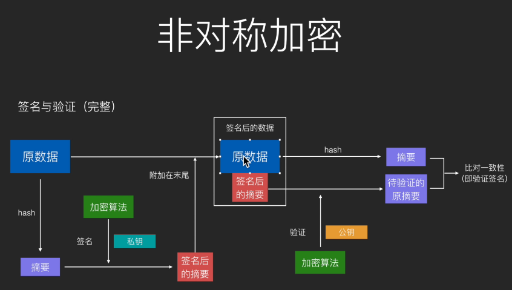

# 各种「转换」的作用和对比——编码、加密、Hash、序列化和字符集

### 一、密码学

- 起源：古代战争--古典密码学。

- 移位式加密：密码棒。
   - 加密算法：缠绕木棒后书写。
   - 密钥：木棒的尺寸规格。

- 替换式加密
   - 加密算法：替换文字。

   - 密钥：码表。 

     

### 二、现代密码学

- 不止可以用于文字内容，还可以用于各种二进制数据。

- 对称加密

  - 原理：使用密钥和加密算法对数据进行转换，得到的无意义数据即为密文；使用密钥和解密算法对密文进行逆向转换，得到原数据。
  - 经典算法：DES，AES。

- 非对称加密

  - 原理：使用公钥对数据进行加密得到密文；使用私钥对数据进行解密得到原数据，加密算法是一样的。私钥加密之后的内容可以用公钥解密出来，但是公钥和私钥不能混淆，公钥就是公钥私钥就是私钥，从他们一诞生就决定了。

  - 延伸用途：数字签名。本质上，数字签名是用私钥加密；如果一串字符串能被公钥解密成原始数据，那么可称这串字符串是被签过名的。

  - 经典算法：RSA（可加密可签名），DSA（只用来签名）。

  - 加密签名过程

    

### 三、密码学密钥和登录密码

- 密钥（key）
  - 场景：用于加密和解密。
  - 目的：保证数据被盗时不会被人读懂。
  - 焦点：数据。
- 登录密码（password）
  - 场景：用户进入网站或游戏前的身份验证。
  - 目的：数据提供方或应用服务方对账户拥有者数据的保护，保证【你是你】的时候才提供权限。
  - 焦点：身份

### 四、Base64

- 将二进制数据转换成由64个字符组成的字符串的编码算法。
- 什么是二进制数据？
  - 侠义的讲，非文本数据成为二进制数据。
  - 广义的讲，所有计算机里面的数据都是二进制数据。
- 用途：
  - 让原数据具有字符串所具有的特性，如可以放在 URL 中传输、可以保存到文本文件、可以通过普通的聊天软件进行文本传输。
  - 把原本人眼可以读懂的字符串变成都不懂的字符串，见底偷窥风险。
- 【Base64 加密传输图片，可以更安全和高效】，真的吗？**N**
- 变种：Base58；去掉长的很像的字符串，方便手抄；去掉斜杠，方便复制。

### 五、URL encoding

- 将 URL 中的保留字符串使用百分号 "%" 进行编码。

### 六、压缩与解压缩

- 压缩：把数据换一种方式来存储，以减少存储空间。
- 解压缩：把压缩的后的数据还原成原先的形式，以便使用。
- 常见压缩算法：DEFLATE（ZIP）、JPEG、MP3。
- 压缩属于编码吗？**Y**
  - 编码到底是什么意思？
  - 那么压缩属于编码吗？**Y**

### 七、媒体数据的编解码

- 什么是图片、音频、视频的硬解码？
- 图片的编码：把图像数据写成 JPG、PNG 等文件的编码格式。
- 图片的解码：把  JPG、PNG 等文件中的数据解析成标准的图像数据。

### 八、序列化

- 序列化：把数据对象（一般是内存中的，例如 JVM 中的对象）转换成字节序列的过程。
- 反序列化：把字节序列重新转换成内存中的对象。
- 目的：让内存中的对象可以被存储和传输。
- 序列化是编码吗？**N**

### 九、Hash

- 定义：把任意数据转换成指定大小范围（通常很小）的数据。
- 作用：摘要、数字指纹。
- 经典算法：MD5、SHA1、SHA256等。
- 实际用途：
  - 数据完整性验证。
  - 快速查找：hasCode() 和 HashMap。
  - 隐私保护
- 彩虹表：常见的数据 Hash 算好之后存储在数据库中，用于"破解" Hash。
- 加盐：给密码 Hash 之前加上其他字符串。
- Hash 是编码吗？ 不是，不可逆。
- Hash 是加密吗？据说 MD5是【不可逆加密】？
  - 不是加密。加密需要可逆。

### 十、签名完整过程

- 简单解析

  1. 发送方持有接受方的公钥，接收方持有发送方的公钥。
  2. 发送方把原数据经过 Hash 算法得到摘要，之后用自己的私钥加密摘要得到签名之后的摘要，附在原数据的后面一起发送给接收方。
  3. 接收方把原数据进行 Hash 得到正确的摘要。
  4. 接收方把签名后的摘要用发送方的公钥进行加密得到待验证的原摘要，再比对原数据 Hash 得到的摘要，就可以验证签名了。

  

### 十一、字符集

- 含义：一个由整数向**现实世界中的文字符号**的 Map。
- 分支
  - ASCII：126个字符，1字节。
  - ISO-8859-1：对 ASCII 进行扩充，1字节。
  - Unicode：13万个字符，多字节。
    - UTF-8：Unicode 的编码分支。
    - UTF-16：Unicode 的编码分支。
  - GBK / GB2312 / GB18030：中国自研标准，多字节，字符集  + 编码。

