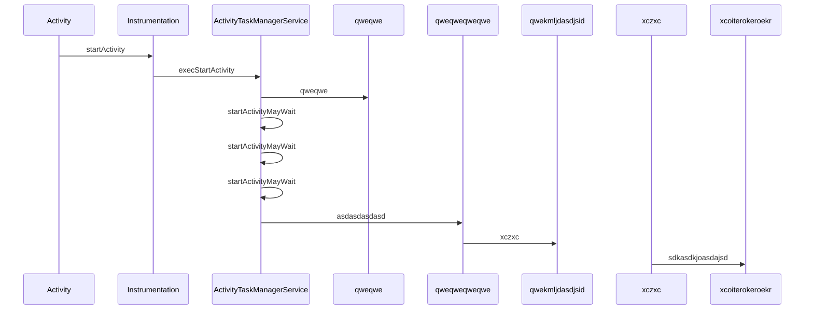
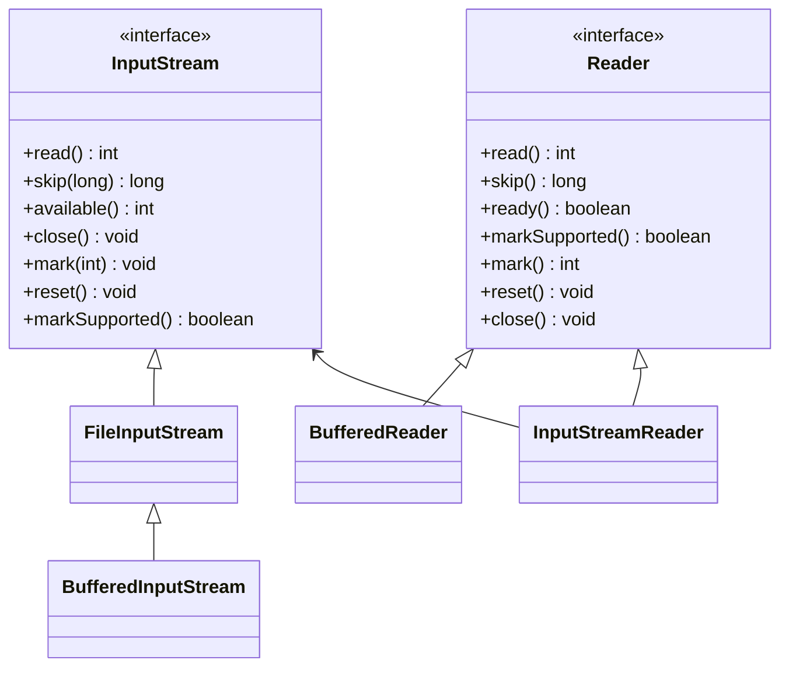

```mermaid

sequenceDiagram

Activity->>Instrumentation:startActivity
Instrumentation->>ActivityTaskManagerService:execStartActivity
ActivityTaskManagerService->>qweqwe:qweqwe
ActivityTaskManagerService->>ActivityTaskManagerService: startActivityMayWait
ActivityTaskManagerService->>ActivityTaskManagerService: startActivityMayWait
ActivityTaskManagerService->>ActivityTaskManagerService: startActivityMayWait
ActivityTaskManagerService->>qweqweqweqwe:asdasdasdasd
qweqweqweqwe->>qwekmljdasdjsid:xczxc
xczxc->>xcoiterokeroekr:sdkasdkjoasdajsd


```

```mermaid
classDiagram
InputStream <|--FileInputStream
FileInputStream<|--BufferedInputStream
Reader<|--BufferedReader
Reader<|--InputStreamReader
InputStream<--InputStreamReader

class InputStream{
<<interface>>
+read()int
+skip(long)long
+available()int
+close()void
+mark(int)void
+reset()void
+markSupported()boolean
}

class FileInputStream{
 
}

class BufferedInputStream{
 
}

class Reader{
<<interface>>
+read()int
+skip()long
+ready()boolean
+markSupported()boolean
+mark()int
+reset()void
+close()void
}

class BufferedReader{
 
}

class InputStreamReader{
 
}
```

