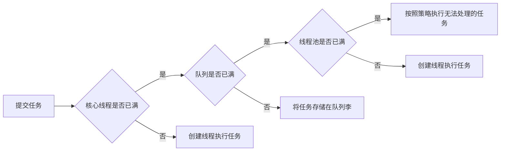

## 线程池主要流程

## 链接

[美团：Java线程池实现原理及其在美团业务中的实践](https://tech.meituan.com/2020/04/02/java-pooling-pratice-in-meituan.html)

[如何优雅的使用和理解线程池](https://crossoverjie.top/2018/07/29/java-senior/ThreadPool/)

