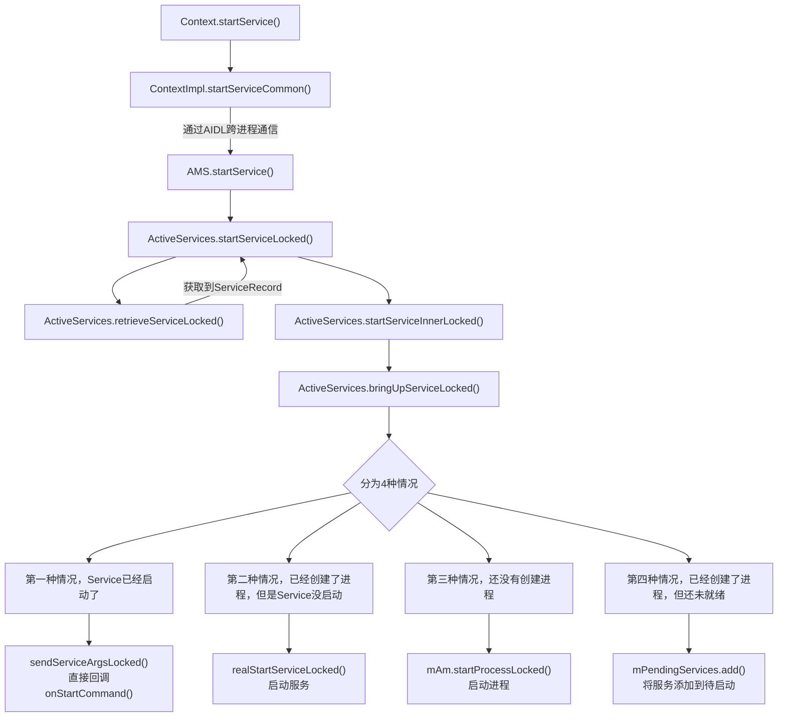

## 时序图

```mermaid
graph TD
1["Context.startService()"]-->2["ContextImpl.startServiceCommon()"]
2-->|通过AIDL跨进程通信|3["AMS.startService()"]
3-->4["ActiveServices.startServiceLocked()"]
4-->5["ActiveServices.retrieveServiceLocked()"]
5-->|获取到ServiceRecord|4
4-->6["ActiveServices.startServiceInnerLocked()"]
6-->7["ActiveServices.bringUpServiceLocked()"]
7-->8{"分为4种情况"}
8-->9["第一种情况，Service已经启动了"]
8-->10["第二种情况，已经创建了进程，但是Service没启动"]
8-->11["第三种情况，还没有创建进程"]
8-->12["第四种情况，已经创建了进程，但还未就绪"]
9-->13["sendServiceArgsLocked()<br>直接回调onStartCommand()"]
10-->14["realStartServiceLocked()<br>启动服务"]
11-->15["mAm.startProcessLocked()<br>启动进程"]
12-->16["mPendingServices.add()<br>将服务添加到待启动"]
```

## 链接

[慕课网：说说service的启动原理](https://coding.imooc.com/lesson/340.html#mid=24590)