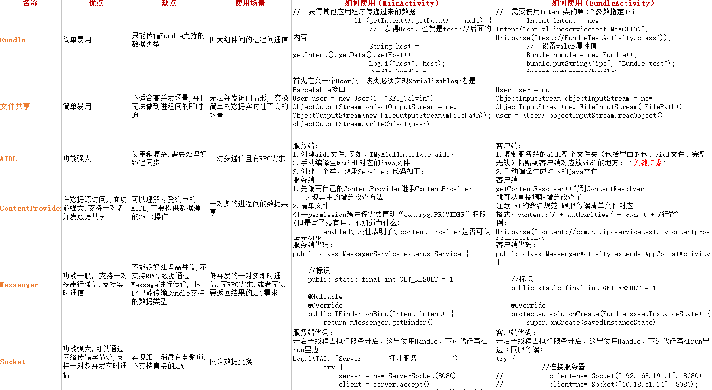

## IPC的6种方式
1. AIDL：AIDL 是 IPC 的一个轻量级实现

2. Messenger（信使）： Messenger本质也是AIDL，只是进行了封装，开发的时候不用再写.aidl文件，所以相对于AIDL较于简单。

3. ContentProvider：ContentProvider相当于为数据存储和获取提供了一个统一的接口

4. Socket：一般用来网络数据的交换

5. 文件共享：通过IO方式把数据写到文件里进行通信，需要注意序列化

6. Bundle（Intent的形式）：一般用于四大组件间的进程间通信，简单易用

## 对比图

## 链接

[简书：浅谈IPC通信之各方式对比使用及场景（四）](%3Ca href="https://www.jianshu.com/p/7abdead13e2b"%3Ehttps://www.jianshu.com/p/7abdead13e2b%3C/a%3E)