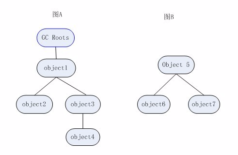

## 一、引用计数法

给对象添加一个引用计数器，每当有一个地方引用它时，计数器值就加1；当引用失效时，计数器值就减1；任何时刻计数器为0的对象就是不可能被再使用的。

**主流的JVM里面没有选用引用计数算法来管理内存，其中最主要的原因是它很难解决对象间的互循环引用的问题。**

## 二、可达性分析算法

通过一些列的称为“GC Roots”的对象作为起始点，从这些节点开始向下搜索，搜索所走过的路径称为**引用链**，当一个对象到GC Roots没有任何引用链相连时（就是从GC Roots 到这个对象是不可达），则证明此对象是不可用的。所以它们会被判定为可回收对象（例如图B中的对象既是不可达的）。

在Java语言中，可以作为GC Roots的对象包括下面几种：

* 虚拟机栈（栈帧中的本地变量表）中引用的对象；
* 方法区中类静态属性引用的对象；
* 方法区中常量引用的对象；
* 本地方法栈中JNI（即一般说的Native方法）引用的对象；]

**在可达性分析算法中，要真正宣告一个对象死亡，至少要经历两次标记过程：**

1.如果对象在进行可达性分析后发现没有与GC Roots相连接的引用链，那它将会被第一次标记并且进行一次筛选，**筛选的条件是此对象是否有必要执行finalize\(\)方法**。当对象没有 覆盖finalize\(\)方法，或者finalize\(\)方法已经被虚拟机调用过，虚拟机将这两种情况都视为“没有必要执行”。

2.如果这个对象被判定为有必要执行finalize\(\)方法，那么这个对象将会放置在一个叫做F-Queue队列之中，并在稍后由一个由虚拟机自动建立的、低优先级的Finalizer线程去执行它。finalize\(\)方法是对象逃脱死亡命运的最后一次机会，稍候GC将对F-Queue中的对象进行第二次小规模的标记，如果对象要在finalie\(\)中成功拯救自己——只要重新与引用链上的任何一个对象建立关联即可，譬如把自己（this关键字）赋值给某个类变量或者对象的成员变量，那在第二次标记时它将会被移除出“即将回收”的集合；如果对象这时候还没有逃脱，那基本上它就真的被回收了。

## 链接
[JVM怎么判断对象是否已死？](https://github.com/LRH1993/android_interview/blob/master/java/virtual-machine/life-cycle.md)