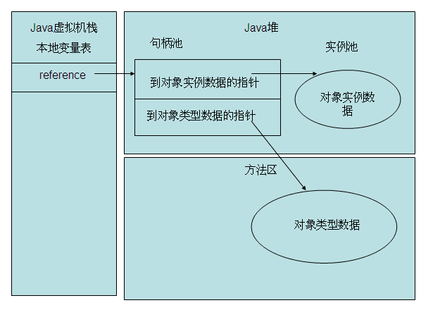
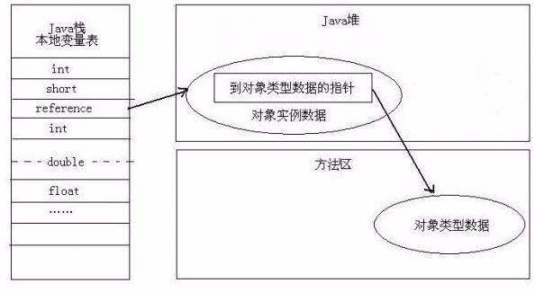

`Java 虚拟机`

## 一、**对象的创建**

1.虚拟机遇到一个 new 指令时，首先将去检查这个指令的参数是否能在**常量池**中定位到一个类的符号引用；

2.**检查这个符号引用代表的类是否已经被加载，解析和初始化过**。如果没有，那必须先执行响应的类加载过程；

3.在类加载检查功通过后，为新生对象**分配内存**。对象所需的内存大小在类加载完成后便可完全确定。

## 二、对象的内存布局

**分为3个区域：对象头，实例数据，对齐填充。**

### 对象头

包括两部分信息，第一部分：对象自身的运行时数据，如哈希码，GC 分代年龄，锁状态标志，线程持有的锁，偏向线程 ID，偏向时间戳等，这部分数据的长度在 32 位和 64 位的虚拟机中分别为 32 bit 和 64 bit，官方称它为 “Mark Word”。

第二部分：类型指针，即对象指向它的类元数据的指针，虚拟机通过这个指针来确定这个对象是哪个类的实例。如果对象是一个java数组，那在对象头中还必须有一块用于记录数组长度的数据。

### 实例数据

是对象真正存储的有效信息，也是在程序代码中所定义的各种类型的字段内容。

### 对齐填充

对齐填充不是必然存在的。HotSpot VM 的自动内存管理系统要求对象起始地址必须是 8 字节的整数倍，也就是说对象的大小必须是 8 字节的整数倍。而对象头部分正好是 8 字节的整数倍。因此，当对象实例数据部分没有对齐时，就需要通过对其补充来补全了。

## 三、对象的访问定位

Java程序需要通过栈上了 reference 数据来操作堆上的具体对象。

目前主流的访问方式有使用句柄和直接指针两种。

### 句柄访问

Java 堆中会划分出一块内存来作为句柄池，reference 中存储的就是对象的句柄地址，而句柄中包含了对实例数据与类型数据的各自具体的地址信息。

优点：使用句柄方式最大的好处就是 reference 中存储的是稳定的句柄地址，在对象被移动（垃圾收集时移动对象是非常普遍的行为）时只会改变句柄中的实例数据指针，而reference本身不需要被修改。

### 直接指针访问（HotSpot 采用的是这种）

reference 中存储的直接就是对象地址。  

优点：使用直接指针方式最大的好处就是**速度更快**，他**节省了一次指针定位的时间开销**。

## 链接

[Github：android_interview：对象的创建、内存布局和访问定位](https://github.com/LRH1993/android_interview/blob/master/java/virtual-machine/object.md)

  