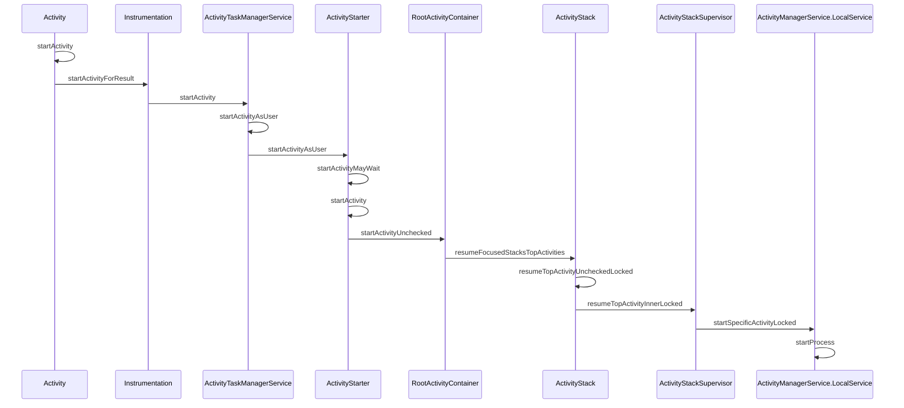

## 流程

1. 首先从 Context.startActivity() 开始，调到 ContextImpl.startActivityForResult()
2. 通过 Instrumentation 通过 AIDL 调用 ActivityTaskManagerService（也是AMS的一部分）的 startActivity() 方法，从应用进程调用到系统进程
3. SystemServer 会有一连串的调用和重载，主要是对于 **Intent 的解析（发生在 ActivityStarter）、任务栈的管理（发生在 ActivityStack 和 ActivityStackSupervisor）、进程的创建和调度（发生在 AMS）** 等等
4. 如果进程没有创建，会先走一遍进程创建的流程，并把这个启动 Activity 的任务悬挂起来，在进程创建好并报道之后回调生命周期
5. 在保证进程已经创建好之后，通过 IApplicationThread 进行跨进程通讯，从系统进程回到应用进程，通过 ActivityThread 中的 Handler 接收到消息并在主线程处理
6. 最后又通过 Instrumentation 反射创建要启动的 Activity，为其创建 ContextImpl，执行 attach 进行一些初始化操作，并调用创建的 Activity 的 onCreate() 回调生命周期

也就是说启动 Activity 其实是至少经过了两次跨进程通讯（App -> SystemServer -> App）才将 Activity 启动起来的。

## 时序图

### 从  Activity.startActivity()  到创建进程  AMS.startProcess()

- Instrumentation：

- ActivityTaskManagerService：

- ActivityStarter：
  > Controller for interpreting how and then launching an activity. This class collects all the logic for determining how an intent and flags should be turned into an activity and associated task and stack.
  > 
  
- RootActivityContainer：

- ActivityStack：
  > State and management of a single stack of activities
  > 

- ActivityStackSupervisor：

- ActivityManagerService.LocalService：

### AMS 创建进程

TODO

## 注意细节

1. Android Q 以后把很多 ActivityManagerService 的逻辑移到了 ActivityTaskManagerService
2. IApplicationThread 是一个 oneway 的 .aidl 文件，说明在 SystemServer 端，调用客户端的方法是异步的，并不关心返回结果，而是设定一个超时时间等待客户端来报道

## 链接

[【基于Android Q】Activity启动流程源码分析【一】](https://www.jianshu.com/p/827fd152a804)

[【基于Android Q】Activity启动流程源码分析【二】](https://www.jianshu.com/p/2fd50292727d)

