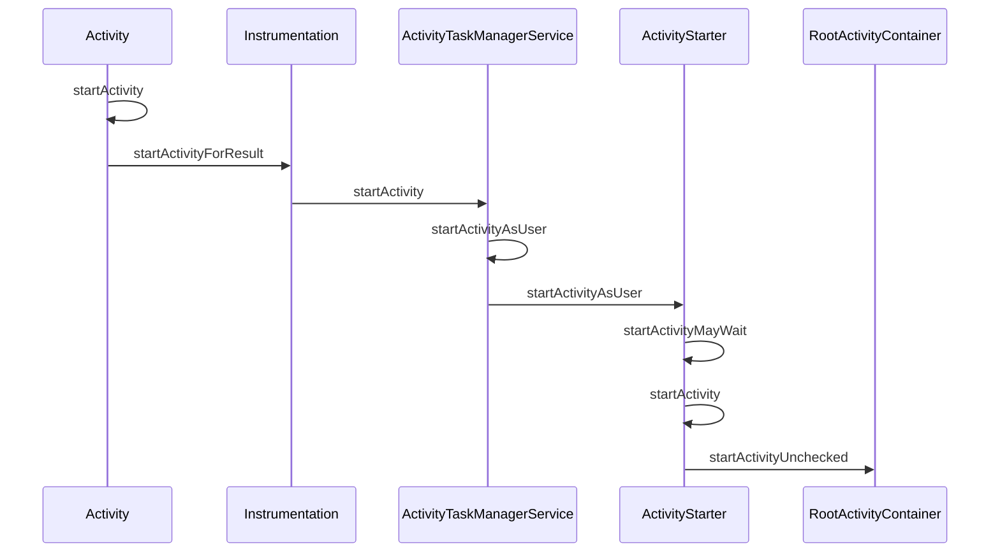
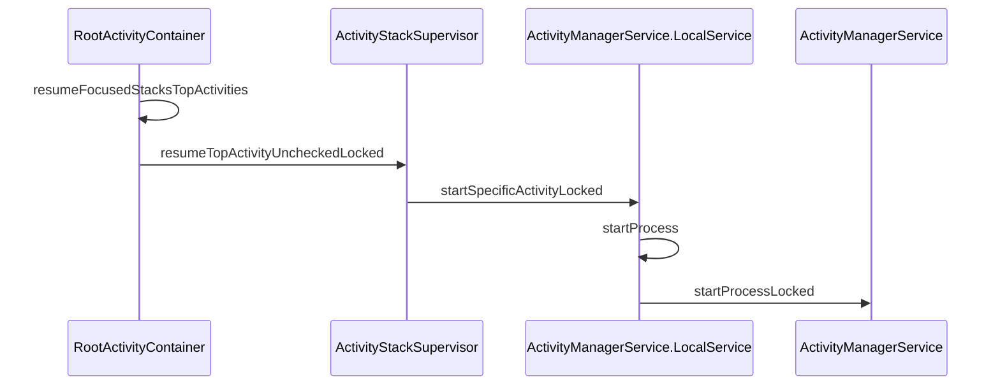

## 流程

1. 首先从 startActivity() 开始
2. 通过 Instrumentation 调用 ActivityTaskManagerService（也是AMS的一部分）通过跨进程通讯，从应用进程调用到系统进程，并在系统进程中进行一些列操作
3. 系统服务会有一系列操作，主要是对于任务栈的管理，进程的创建等等
4. 在系统服务处理完成后，通过 IApplicationThread 也进行跨进程通讯，从系统进程回到应用进程，通过 ActivityThread 中的 Handler 接收到消息并在主线程处理
5. 最后又通过 Instrumentation 反射创建要启动的 Activity，并调用创建的 activity 的 onCreate 方法

也就是说启动 Activity 其实是经过了两次跨进程通讯（App -> SystemServer -> App）才将 Activity 启动起来的。

## 时序图

## 注意细节

1. Android Q 以后把很多 ActivityManagerService 的逻辑移到了 ActivityTaskManagerService

## 链接

[【基于Android Q】Activity启动流程源码分析【一】](https://www.jianshu.com/p/827fd152a804)

[【基于Android Q】Activity启动流程源码分析【二】](https://www.jianshu.com/p/2fd50292727d)

