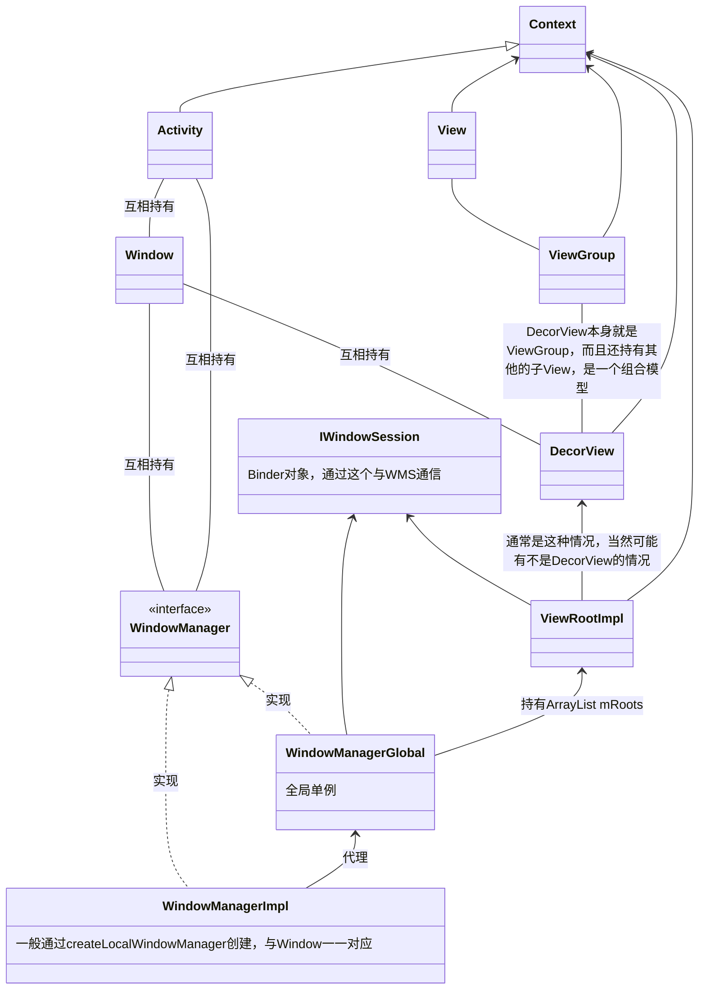

## 流程
- 我们在 setContentView 会执行以下操作，创建 DecorView，和主显示区域 content，把我们定义的 layout 添加到 content 中

- 在 handleResumeAcitivty() 时，会调用 WindowManager 的 addView，最终会调到 WindowManagerGlobal 的 addView
- 随后会创建 ViewRootImpl，并把 DecorView 传入到 ViewRootImpl 中作为其子 View，ViewRootImpl 作为整个层级（Hierarchy）的最顶层
- 随后执行 Activity 的 makeVisible，要求重新布局
- ViewRootImpl 开始遍历，先向系统请求 Surface，然后执行三个绘制流程，最后把 Surface 传到 WMS，WMS 传到 SurfaceFlinger 显示到屏幕上

## 要点

- ViewRootImpl 作为层级的最顶层，只能有一个子 View（不一定要求是 DecorView，不过通常都是 DecorView）

- ViewRootImpl 有一个 checkThread 方法，检查 UI 线程，注意：**检查的是创建 ViewRootImpl 的线程，而不一定要求是主线程，意思是UI线程不一定要求是主线程**
- ViewRootImpl 创建的时机的 ActivityThread 执行 handleResumedActivity 最后执行 WindowManagerGlobal 的 addView
- ViewRootImpl 集成了 ViewParent，和 ViewGroup 一样可以作为 View 的 Parent，是 View 的实现类（类似 ContextImpl）
- 每个 Activity 对应一个 PhoneWindow，每个 PhoneWindow 对应一个 WindowManagerImpl，WindowManagerGlobal 是一个单例，里面有具体的实现方法

## 架构图

## 类图

### 类图可以反映出：

- Activity 并不直接持有 View，而是通过中间的 Window 与 View 交互（例如：setContentView() 方法）
- IWindowSession 与 WMS 交互，WindowManagerGlobal 作为全局单例持有 IWindowSession，在创建 ViewRootImpl 时，也会直接把 IWindowSession  传递过去，让 ViewRootImpl 能直接与 WMS 进行交互（比如在 ViewRootImpl 能直接收到从 WMS 收到的按键回调）
- 几乎这中间所有的角色都持有 Context（即 Activity），它们需要一个对象来获取全局的资源（Resources、系统服务等等）

## 链接

[慕课网：说说Activity的显示原理](https://coding.imooc.com/lesson/340.html#mid=24588)