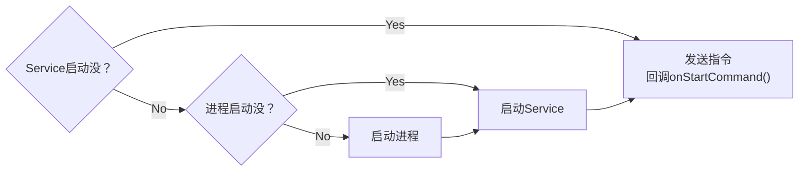
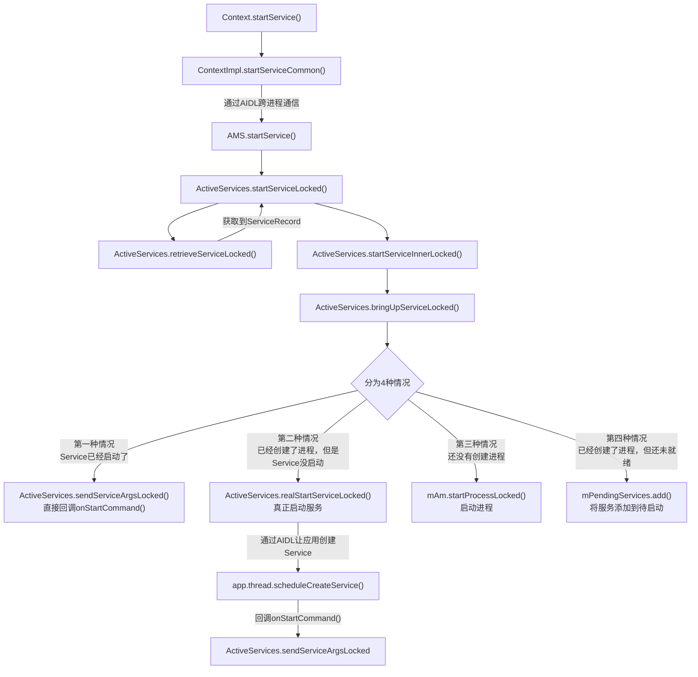

`Framework 源码`、`四大组件`

## 简单流程图

## 方法调用流程图

### 参与者

ContextImpl：客户端真正调用 startService() 的地方

AMS：服务端给客户端的接口

ActiveServices：服务端真正处理 Service 调度的地方

## 链接

[慕课网：说说service的启动原理](https://coding.imooc.com/lesson/340.html#mid=24590)