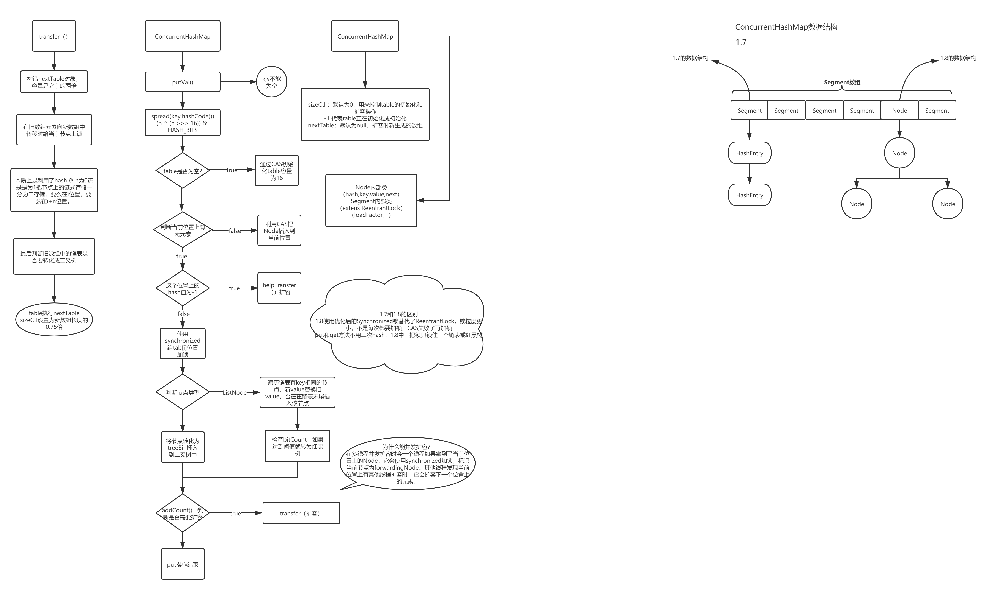

`Java 并发`、`Java 集合`

## putVal() 的流程图

## ConcurrentHashMap 在 JDK 1.7 和 JDK 1.8 的区别？

其实可以看出 JDK 1.8 版本的 ConcurrentHashMap 的数据结构已经接近 HashMap

- 相对而言，ConcurrentHashMap 只是在 HashMap 的基础上增加了同步的操作来控制并发，从 JDK 1.7 版本的 ReentrantLock+Segment+HashEntry，到 JDK 1.8 版本中 synchronized+CAS+HashEntry+红黑树
- 数据结构：取消了 Segment 分段锁的数据结构，取而代之的是数组+链表+红黑树的结构
- 保证线程安全机制：JDK 1.7 采用 segment 的分段锁机制实现线程安全，其中 Segment 继承自 ReentrantLock。JDK 1.8 采用 CAS+synchronized 保证线程安全
- 锁的粒度：原来是对需要进行数据操作的 Segment 加锁，现调整为对每个数组元素加锁（Node）
- 链表转化为红黑树：定位结点的 Hash 算法简化会带来弊端，Hash 冲突加剧，因此在链表节点数量大于 8 时，会将链表转化为红黑树进行存储
- 查询时间复杂度：从原来的遍历链表 O(n)，变成遍历红黑树 O(logn)

## 链接

[面试：为了进阿里，死磕了ConcurrentHashMap源码和面试题(一)](https://segmentfault.com/a/1190000024432650)

[面试：为了进阿里，死磕了ConcurrentHashMap源码和面试题(二)](https://segmentfault.com/a/1190000024439085)

