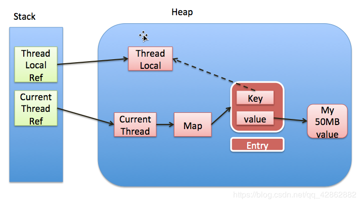

`Java 并发`

## 原理

1. ThreadLocal 调用 get() 方法时，会先拿到当前线程对应的 ThreadLocalMap（这个 Map 是 Thread 的字段，因此线程唯一，**每个线程都对应唯一的 ThreadLocalMap**）
2. 在调用 ThreadLocalMap 的 getEntry() 方法，该方法是以 ThreadLocal 为 key（**为了保持 key 每次都不变，通常 ThreadLocal 要以静态变量来使用**）
3. 其 Entry 继承了 WeakReference，弱引用 key（即 ThreadLocal），这一步是为了防止 ThreadLocal 因为被 Entry 持有无法被回收
4. 参考第 3 点，其实我们通常会把 ThreadLocal 作为静态变量来使用，因此最好用完 remove 掉

## 引用图

## ThreadLocalMap 和 WeakHashMap 对比

|           | ThreadLocalMap               | WeakHashMap                             |
| --------- | ---------------------------- | --------------------------------------- |
| 对象持有  | 弱引用                       | 弱引用                                  |
| 对象 GC   | 不影响                       | 不影响                                  |
| 引用清除  | 主动移除 线程退出时移除 | 主动移除 GC 后移除(ReferenceQueue) |
| Hash 冲突 | 开放定址法                   | 单链表法                                |
| Hash 计算 | 神奇数字的倍数               | 对象 hashCode 再散列                    |
| 适用场景  | 对象较少                     | 通用                                    |

## 链接

[CSDN：ThreadLocal为什么要用弱引用和内存泄露问题](https://blog.csdn.net/tmr1016/article/details/100141446)

[慕课网：如何写出线程安全的程序？](https://coding.imooc.com/lesson/317.html#mid=22295)