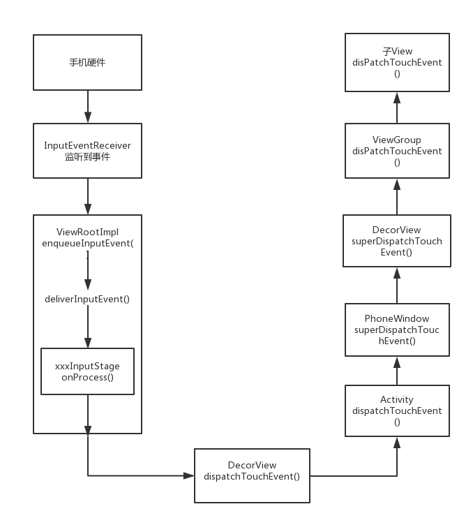
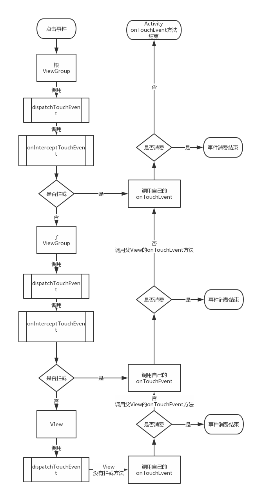

## 事件从手指点击到产生然后分发的全过程

事件分发的传递顺序：用户点击 -> 手机硬件 -> 传递到ViewRootImpl<u>（通过InputEventReceiver来接收事件通知）</u> -> DecorView-> Activity(从这里开始常规的分发) -> PhoneWindow-> DecorView<u>（本质上也是ViewGroup，最顶层的ViewGroup ）</u> -> ViewGroup -> View


## MotionEvent事件分发

##### 三大方法：

1. **dispatchTouchEvent**：它就是事件分发的重要方法。那么很明显，如果一个MotionEvent传递给了View，那么dispatchTouchEvent方法一定会被调用。返回值：表示是否消费了当前事件 。可能是View本身的onTouchEvent方法消费，也可能是子View的dispatchTouchEvent方法中消费。返回true表示事件被消费，本次的事件终止。返回false表示View以及子View均没有消费事件，将调用父View的onTouchEvent方法

2. **onInterceptTouchEvent**：事件拦截，当一个ViewGroup在接到MotionEvent事件序列时候，首先会调用此方法判断是否需要拦截。特别注意，这是ViewGroup特有的方法，View并没有拦截方法返回值：是否拦截事件传递，返回true表示拦截了事件，那么事件将不再向下分发而是调用View本身的onTouchEvent方法。返回false表示不做拦截，事件将向下分发到子View的dispatchTouchEvent方法。

3. **onTouchEvent**：真正对MotionEvent进行处理或者说消费的方法。在dispatchTouchEvent进行调用。返回值：返回true表示事件被消费，本次的事件终止。返回false表示事件没有被消费，将调用父View的onTouchEvent方法

##### 伪代码：
```
    public boolean dispatchTouchEvent(MotionEvent ev) {
        boolean consume = false; // 事件是否被消费
        if (onInterceptTouchEvent(ev)){ // 调用onInterceptTouchEvent判断是否拦截事件
            consume = onTouchEvent(ev); // 如果拦截则调用自身的onTouchEvent方法
        } else {
            consume = child.dispatchTouchEvent(ev); // 不拦截调用子View的dispatchTouchEvent方法
        }
        return consume; // 返回值表示事件是否被消费，true事件终止，false调用父View的onTouchEvent方法
    }
```
##### 特别强调：

1. 子ViewGroup可以通过**requestDisallowInterceptTouchEvent**方法干预父ViewGroup的事件分发过程（ACTION_DOWN事件除外），而这就是我们处理滑动冲突常用的关键方法

2. 对于View（注意！ViewGroup也是View）而言，如果设置了onTouchListener，那么OnTouchListener方法中的onTouch方法会被回调。onTouch方法返回true，则onTouchEvent方法不会被调用（onClick事件是在onTouchEvent中调用）所以三者优先级是<u>onTouch->onTouchEvent->onClick</u>

3. View 的onTouchEvent 方法默认都会消费掉事件（返回true），除非它是不可点击的（clickable和longClickable同时为false），View的longClickable默认为false，clickable需要区分情况，如Button的clickable默认为true，而TextView的clickable默认为false

## 事件从点击到产生到分发的过程


## MotionEvent的时间分发



## 链接
[GitHub：Android事件分发机制](https://github.com/LRH1993/android_interview/blob/master/android/basis/Event-Dispatch.md)


[简书：初探Android事件分发机制源码上之从硬件出发（从硬件开始分析）](https://www.jianshu.com/p/59615d0c9e7d)


[简书：一文读懂Android View事件分发机制（有笔记）](https://www.jianshu.com/p/238d1b753e64)


[CSDN：Android Window 机制探索](https://blog.csdn.net/qian520ao/article/details/78555397#window%E7%9A%84%E6%A6%82%E5%BF%B5)